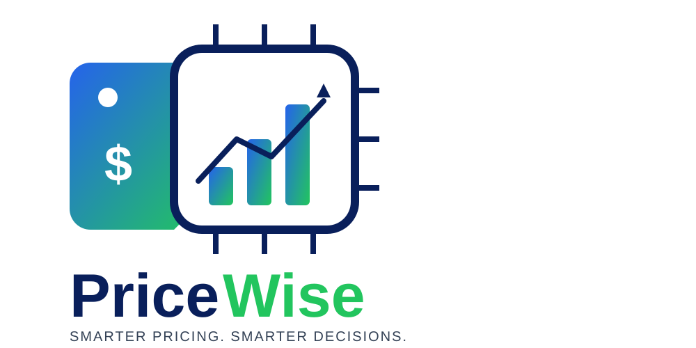

<!-- _class: lead -->
<!-- _paginate: false -->

<div class="title-row">
<div class="title-text">

# **PriceWise**
### Material Price Intelligence & Procurement Decision Engine

**FABathon 2026 Solution**
*Tata Electronics / TSMPL Semiconductor Sourcing Challenge*

</div>

</div>

---

## **1. The Problem: Semiconductor Sourcing Complexity**

Semiconductor manufacturing relies on highly specialized consumables and raw materials (CMP Slurries, Photoresists, Sputtering Targets, High-Purity Gases).

### **Key Sourcing Challenges:**
- <span class="highlight">Limited Historical Data:</span> Sparse price histories for custom formulations.
- <span class="highlight">Fragmented Market Intelligence:</span> Unstructured news, geopolitical events, and tariff changes.
- <span class="highlight">Expertise Bottleneck:</span> Sourcing decisions rely on tacit buyer knowledge rather than systemized intelligence.
- <span class="highlight">Black-Box ML Rejection:</span> Procurement teams distrust purely statistical "black-box" predictions.

---

## **2. Core Product Philosophy: 4 Key Sourcing Questions**

PriceWise is an **explainable decision-support engine**, not a black-box forecaster.

<div class="card-grid">

<div class="card">
<div class="card-title">1. WHAT is likely to happen?</div>
Directional point forecasts with confidence bounds and time horizons.
</div>

<div class="card">
<div class="card-title">2. WHY is it likely to happen?</div>
Decomposition into real economic cost drivers (Rare Earths, Energy, Freight, FX).
</div>

<div class="card">
<div class="card-title">3. HOW CONFIDENT are we?</div>
Transparent 5-component confidence scoring heuristic (0–100 score).
</div>

<div class="card">
<div class="card-title">4. WHAT SHOULD PROCUREMENT DO?</div>
Actionable strategies (`SHORT_LOCK`, `NEGOTIATE`, `DUAL_SOURCE`, `WAIT`).
</div>

</div>

---

## **3. End-to-End System Architecture**

```
 ┌────────────────────────────────────────────────────────────────────────┐
 │                      Next.js 14 Frontend Dashboard                     │
 │          (Material Explorer, Forecast Overview, Supplier Intelligence)  │
 └───────────────────────────────────┬────────────────────────────────────┘
                                     │ REST API
 ┌───────────────────────────────────▼────────────────────────────────────┐
 │                        FastAPI Backend Engine                          │
 ├────────────────────────────────────────────────────────────────────────┤
 │  • Material Knowledge Graph (Material → Component → Driver → Supplier)  │
 │  • Hybrid Forecast Pipeline (Baselines + Driver Model + ML Residual)   │
 │  • 5-Factor Confidence Engine & Decision Rule Processor                │
 │  • What-If Scenario Simulator & Batch Supplier Quote Analyzer          │
 └───────────────────────────────────┬────────────────────────────────────┘
                                     │ SQLAlchemy ORM
 ┌───────────────────────────────────▼────────────────────────────────────┐
 │              Relational Database (SQLite / PostgreSQL)                  │
 └────────────────────────────────────────────────────────────────────────┘
```

---

## **4. The Material Knowledge Graph**

PriceWise structures materials as a **hierarchical graph/tree** rather than flat text.

```
CMP Slurry (Material)
 ├── Ceria Abrasive (Component - 42% cost)
 │    ├── Rare Earth Index (Driver) ─── [Strength: 0.87]
 │    └── FX Index (Driver) ─────────── [Strength: 0.30]
 ├── Oxidizer / H2O2 (Component - 18% cost)
 │    └── Energy / Industrial Gas ──── [Strength: 0.65]
 └── Logistics & Dispersant (Component - 40% cost)
      └── Freight Index ─────────────── [Strength: 0.50]
```

- Enables economics-grounded price modeling.
- Driver relationships are weighted by **component cost share × elasticity**.

---

## **5. Hybrid Forecasting Engine**

To handle limited semiconductor time-series data without overfitting, PriceWise uses a **4-tier hybrid pipeline**:

1. **Statistical Baselines:** Moving Average, Exponential Smoothing, Seasonal Naive.
2. **Economically Interpretable Driver Model:** Ridge regression mapped to knowledge graph weighted drivers:
   `Price Change = Intercept + sum(Weight_i * Driver_i Change)`
3. **ML Residual Model:** LightGBM trained on residual errors (`Actual Price Change - Driver Forecast`). Skipped automatically when history < 18 months.
4. **Walk-Forward Ensemble:** Time-series validation weights models based on historical accuracy without data leakage.

---

## **6. Adaptive Data Modes & Explainability**

### **Adaptive Low-Data Handling**
- **Fewer than 12 observations (`LOW_DATA`):** Suppresses ML model; relies on baseline + driver model; reduces confidence score automatically.
- **More than 48 observations (`STRONG_DATA`):** Full ensemble enabled with ML residual modeling.

### **Driver Contribution Waterfall**
- Allocates price changes across real economic drivers (e.g., Ceria +4.1%, Energy +1.2%, Freight +0.8%, FX +0.7%).
- Generates plain-English narrative explanations without relying on external LLM calls.

---

## **7. 5-Factor Confidence Scoring Framework**

PriceWise computes a transparent, explainable confidence score (0 to 100):

`Overall Score = 0.20 × Data + 0.25 × Driver + 0.25 × Model + 0.15 × Market + 0.15 × Stability`

<div class="card-grid">

<div class="card">
<div class="card-title">Data Quality (20%)</div>
Evaluates history length, sample frequency, and data mode tier.
</div>

<div class="card">
<div class="card-title">Driver Strength (25%)</div>
Aggregates knowledge graph edge relationship strengths.
</div>

<div class="card">
<div class="card-title">Model Performance (25%)</div>
Measures walk-forward backtest directional accuracy and MAPE.
</div>

<div class="card">
<div class="card-title">Stability & Signals (30%)</div>
Penalizes model disagreement and sudden volatility regime shifts.
</div>

</div>

---

## **8. Procurement Decision Engine**

Translates quantitative forecast outputs and supply risk into actionable sourcing guidance.

### **Decision Rule Logic**
- **Rising Forecast + High Confidence + High Supply Risk:** &rarr; <span class="highlight">`SHORT_LOCK`</span> (3 Months)
- **Rising Forecast + High Confidence + Manageable Risk:** &rarr; <span class="highlight">`NEGOTIATE`</span> (1–3 Months)
- **Falling Forecast + High Confidence + Manageable Risk:** &rarr; <span class="highlight">`WAIT`</span> (1 Month)
- **High Supplier Concentration / Single Source:** &rarr; <span class="highlight">`DUAL_SOURCE`</span>

Includes an **Evidence & Audit Trail** linking every recommendation back to forecast bounds, market events, and supplier risk factors.

---

## **9. Integrated Supplier Intelligence & Quote Analysis**

Converts static supplier lists into an active decision-support system.

### **Core Functionality**
- **Supplier Catalog & Detail View:** Qualification status, lead time, share of supply, risk scores, and quote history.
- **Dynamic Quote Batch Analysis:** Compares supplier quotes against active market forecast.
- **Claim Support & Negotiation Anchor:**
  - Identifies **Market-Supported Change** vs. **Unexplained Premium**.
  - Classifies quotes as <span class="highlight">`SUPPORTED`</span>, <span class="highlight">`PARTIALLY_SUPPORTED`</span>, or <span class="highlight">`UNSUPPORTED`</span>.
  - Recommends specific negotiation target prices.

---

## **10. What-If Scenario Simulator & Causal Chain**

Allows procurement managers to simulate driver shocks (e.g., Rare Earth +15%, Freight +10%) and observe real-time causal propagation:

```
 Driver Assumption Shift (What-If)
               │
               ▼
   Forecast & Range Change
               │
               ▼
 Quote vs. Forecast Gap Shift
               │
               ▼
 Supplier Recommendation Shift
```

*Example:* A supplier quote deemed `UNSUPPORTED` under base market conditions may become `SUPPORTED` under an elevated energy/driver scenario.

---

## **11. Demonstration Capabilities (Seeded Hero Story)**

PriceWise includes a complete seed pipeline with synthetic semiconductor materials:

- **MAT-001 (Ceria CMP Slurry):** 48-month history, single-source, hero narrative +9% supplier quote claim vs +6.2% market forecast.
- **MAT-002 (Hydrogen Peroxide):** Commodity chemical driven by energy indices.
- **MAT-003 (Specialty Photoresist Polymer):** 8-month sparse history showcasing automatic `LOW_DATA` mode and reduced confidence.
- **MAT-004 (Copper Sputtering Target):** Metal-index driven material.

---

## **12. Future Roadmap & Scaling Vision**

| Phase | Horizon | Focus Areas |
|---|---|---|
| **Phase 4** | Market Intelligence | LLM-driven unstructured news/event extraction, impact scoring, & source credibility rating. |
| **Phase 5** | Live Connectors | Integration with live commodity feeds (LME, Platts, ICIS) & ERP systems (SAP/Oracle). |
| **Phase 6** | Advanced Sourcing | Automated supplier negotiation playbook generator & multi-tier BOM risk modeling. |

---

<!-- _class: lead -->

<div class="title-row">
<div class="title-text">

# **Thank You!**

### **PriceWise**
*Material Price Intelligence & Procurement Decision Engine*

</div>

</div>

**Empowering semiconductor supply chains with explainable, data-driven sourcing.**
